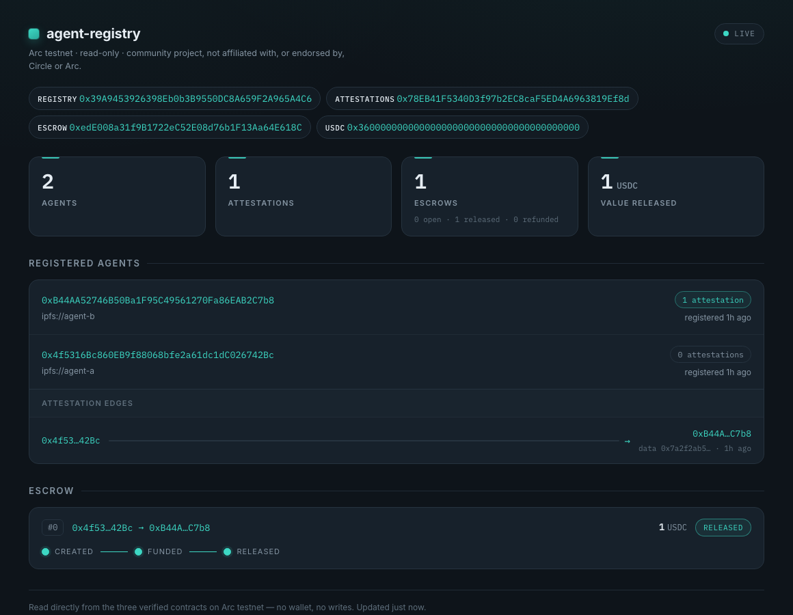

# agent-registry

**A composable on-chain primitive for the agent economy on Arc** — an agent identity + reputation
registry (Know-Your-Agent) plus a minimal USDC escrow, as clean, reusable Solidity that other Arc
projects can import. Contracts are the product; a small read-only dashboard is the shop window.

> ⚠️ **Testnet only** — deployed to the Arc **public testnet** (chain `5042002`); all USDC is
> test-value with no real-world worth. **Not affiliated with, or endorsed by, Circle or Arc.**
> Community primitive for the Arc ecosystem. (Working name `agent-registry`; rename-safe.)

The three contracts are **live and verified on Arc testnet**, composable today:

| Contract | Address | Explorer |
| --- | --- | --- |
| **AgentRegistry** — identity / KYA | `0x39A9453926398Eb0b3B9550DC8A659F2A965A4C6` | [arcscan ↗](https://testnet.arcscan.app/address/0x39A9453926398Eb0b3B9550DC8A659F2A965A4C6) |
| **AgentAttestations** — EIP-712 reputation | `0x78EB41F5340D3f97b2EC8caF5ED4A6963819Ef8d` | [arcscan ↗](https://testnet.arcscan.app/address/0x78EB41F5340D3f97b2EC8caF5ED4A6963819Ef8d) |
| **AgentEscrow** — USDC escrow | `0xedE008a31f9B1722eC52E08d76b1F13Aa64E618C` | [arcscan ↗](https://testnet.arcscan.app/address/0xedE008a31f9B1722eC52E08d76b1F13Aa64E618C) |

Native USDC (6-decimal ERC-20): `0x3600000000000000000000000000000000000000`.
The full deployment record (tx hashes, constructor args, ABIs) is in
[`deployments/arc-testnet.json`](deployments/arc-testnet.json).

## What it is

Three small, single-purpose contracts that snap together:

- **AgentRegistry** — an agent registers itself with a `metadataURI` (e.g. an IPFS card describing
  what it does). One record per address; updatable by the owner. This is the "who is this agent"
  layer other contracts gate on with `isRegistered(agent)`.
- **AgentAttestations** — anyone can vouch for a registered agent by posting a `bytes32` claim
  (`attest`), directly or via an **EIP-712 signature** so a relayer can pay gas (`attestWithSig`).
  Reputation is simply the count/history of attestations a subject has received — read with
  `getAttestations(subject)` / `attestationCount(subject)`.
- **AgentEscrow** — a payer locks USDC for a payee against a deadline (`createEscrow`), then
  `release`s it to the payee or `refund`s it back after expiry. Funds-holding, so it is the
  security-critical piece: checks-effects-interactions, `ReentrancyGuard`, `SafeERC20`,
  pull-over-push.

Enumeration is done off-chain from **event logs** — the contracts deliberately hold no growable
arrays on-chain (cheaper, no unbounded-loop DoS surface). The dashboard and the snippets below both
read state that way.



## Compose with it

The contracts are meant to be imported, not forked. ABIs are checked in under
[`deployments/abi/`](deployments/abi/) — `AgentRegistry.json`, `AgentAttestations.json`,
`AgentEscrow.json` (plus the `IAgentRegistry.json` interface). Point any client at the addresses
above.

### Read the registry (viem, read-only — no key)

```ts
import { createPublicClient, http, parseAbiItem } from "viem";

const client = createPublicClient({ transport: http("https://rpc.testnet.arc.network") });
const REGISTRY = "0x39A9453926398Eb0b3B9550DC8A659F2A965A4C6";

// Is this address a registered agent?
const known = await client.readContract({
  address: REGISTRY,
  abi: [parseAbiItem("function isRegistered(address) view returns (bool)")],
  functionName: "isRegistered",
  args: ["0xB44AA52746B50Ba1F95C49561270Fa86EAB2C7b8"],
});

// Enumerate every agent from events (chunk under Arc's 10k-block getLogs cap).
const agents = await client.getLogs({
  address: REGISTRY,
  event: parseAbiItem("event AgentRegistered(address indexed agent, string metadataURI, uint256 timestamp)"),
  fromBlock: 50103930n, // deployBlock — see deployments/arc-testnet.json
  toBlock: "latest",
});
```

### Gate your contract on the registry (Solidity)

```solidity
import { IAgentRegistry } from "agent-registry/interfaces/IAgentRegistry.sol";

contract OnlyAgents {
    IAgentRegistry public constant REGISTRY =
        IAgentRegistry(0x39A9453926398Eb0b3B9550DC8A659F2A965A4C6);

    modifier onlyRegisteredAgent() {
        require(REGISTRY.isRegistered(msg.sender), "not a registered agent");
        _;
    }
}
```

### Post an attestation (viem, writes — signer required)

```ts
import { createWalletClient, http, parseAbiItem, stringToHex } from "viem";
import { privateKeyToAccount } from "viem/accounts";

const wallet = createWalletClient({
  account: privateKeyToAccount(process.env.PRIVATE_KEY as `0x${string}`),
  transport: http("https://rpc.testnet.arc.network"),
});

// Vouch for a registered agent with an arbitrary bytes32 claim.
await wallet.writeContract({
  address: "0x78EB41F5340D3f97b2EC8caF5ED4A6963819Ef8d",
  abi: [parseAbiItem("function attest(address subject, bytes32 data)")],
  functionName: "attest",
  args: ["0xB44AA52746B50Ba1F95C49561270Fa86EAB2C7b8", stringToHex("did-good-work", { size: 32 })],
});
```

Gasless variant: build the EIP-712 `Attest(address attester,address subject,bytes32 data,uint256
nonce,uint256 deadline)` typed data (domain `AgentAttestations` / version `1`), have the attester
sign it, and let a relayer submit `attestWithSig(attester, subject, data, nonce, deadline, signature)`.

### Use the escrow (viem, writes — USDC on 6 decimals)

```ts
import { parseAbiItem, parseUnits } from "viem";

const USDC = "0x3600000000000000000000000000000000000000"; // 6 decimals — never assume 18
const ESCROW = "0xedE008a31f9B1722eC52E08d76b1F13Aa64E618C";
const amount = parseUnits("1", 6); // 1.000000 USDC

// 1. approve the escrow to pull the funds
await wallet.writeContract({
  address: USDC,
  abi: [parseAbiItem("function approve(address spender, uint256 amount) returns (bool)")],
  functionName: "approve",
  args: [ESCROW, amount],
});

// 2. lock funds for a payee against a deadline; returns the new escrow id
const id = await wallet.writeContract({
  address: ESCROW,
  abi: [parseAbiItem("function createEscrow(address payee, uint256 amount, uint64 deadline) returns (uint256)")],
  functionName: "createEscrow",
  args: ["0xB44AA52746B50Ba1F95C49561270Fa86EAB2C7b8", amount, BigInt(deadlineUnix)],
});

// 3. later: release(id) pays the payee, or refund(id) returns funds to the payer after the deadline.
```

> ⚠️ On Arc, moving native USDC hits a system precompile that `forge script`'s local simulation
> can't run — see the gotcha below. `cast send` / a real wallet against the live RPC work fine.

## Dashboard

A **read-only** window on the live contracts — registered agents, their attestations/reputation, and
escrow status (open / released / refunded). It reads on-chain state directly via viem and serves a
self-contained dark/violet page. **No wallet, no keys in the browser, no writes** — it only ever
calls view methods and reads event logs.

```bash
cd dashboard
bun install
bun run src/index.ts          # → http://127.0.0.1:4025
# override the RPC or port if you like:
#   ARC_RPC_URL=https://rpc.testnet.arc.network PORT=4025 bun run src/index.ts
```

Then open the printed URL. State refreshes every 15s and is cached server-side for 8s. Addresses,
ABIs, RPC, and the deploy block all come from `deployments/` — nothing is re-hardcoded in the
dashboard. Tests: `cd dashboard && bun test` (the model assembly is a pure, unit-tested function).

## Build & verify the contracts

```bash
forge build
forge test
forge fmt --check
slither .            # static analysis — must be clean
```

Deployed contracts are **immutable** — a bug can't be patched and a security flaw loses funds. So
Slither runs every stage and a finding is treated like a failing test; tests are written first (TDD);
only known-safe patterns are used (checks-effects-interactions, `ReentrancyGuard`, `SafeERC20`, no
`tx.origin`, pull-over-push). USDC on Arc is **6 decimals** — never assumed 18, never hardcoded (read
from `deployments/`).

## Arc gotcha: `forge script` simulation vs `cast` against the live node

Arc's native USDC is not a plain ERC-20 — its `transferFrom` invokes a **system precompile at
`0x1800000000000000000000000000000000000001`** (an on-chain blocklist check). `forge script`
simulates the whole transaction in a **local EVM that doesn't have that precompile**, so any escrow
flow that moves USDC reverts during simulation with a `StackUnderflow`/precompile error — even though
the exact same calls succeed on-chain.

**Fix:** run funds-moving flows with `cast send` against the real RPC (which has the precompile)
instead of `forge script --broadcast`. The live end-to-end smoke lives in
[`script/smoke.sh`](script/smoke.sh) for that reason, and its real tx hashes are recorded in
`deployments/arc-testnet.json`. Read-only `forge script` / `cast call` are unaffected — this only
bites transactions that actually transfer native USDC.

## Status

Built in public, stage by stage (each stage = a git tag; TDD + Slither every stage):

- **v0.1.0** — scaffold + CI (build/test/Slither) + Arc deploy config.
- **v0.2.0** — AgentRegistry.
- **v0.3.0** — AgentAttestations + AgentEscrow.
- **v0.4.0** — deploy + verify all three on Arc testnet; live smoke.
- **v1.0.0** — read-only dashboard + this README. 🎉

## License

MIT — see `LICENSE`.
